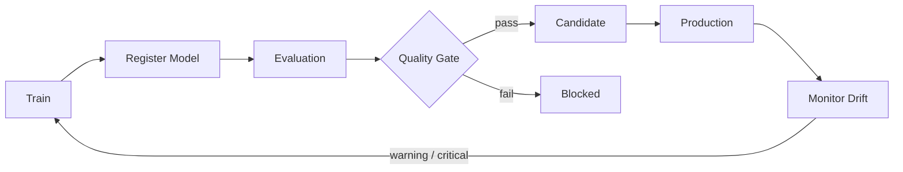

# ⚙️ MLOps Control Plane

A compact model lifecycle control plane for **registration, quality gates, promotion and drift monitoring**.

## Implemented

- model artifact registry
- SHA-256 dataset fingerprints
- evaluation records
- promotion policy
- stage transitions
- Population Stability Index (PSI)
- drift severity classification
- standalone append-only JSONL state utility (not API persistence)
- FastAPI service
- tests
- Docker

## Lifecycle



## Why this project matters

The interesting part of production ML is not just training a model. Teams need to answer:

- Which dataset produced this artifact?
- Which metrics were used to approve it?
- Why was a model promoted?
- Which model is currently in production?
- What happens to the previous production version?
- Is the live data distribution drifting?

This project makes that lifecycle explicit and inspectable.

## Example

```python
from mlops_cp.models import Evaluation, ModelVersion
from mlops_cp.registry import ModelRegistry

registry = ModelRegistry()

registry.register(
    ModelVersion(
        name="churn",
        version="1.2.0",
        artifact_uri="s3://models/churn/1.2.0",
        dataset_fingerprint="sha256:...",
    )
)

registry.add_evaluation(
    "churn",
    "1.2.0",
    Evaluation(
        metric="roc_auc",
        value=0.91,
        threshold=0.85,
    ),
)

decision = registry.promote_candidate("churn", "1.2.0")

if decision.allowed:
    registry.promote_production("churn", "1.2.0")
```

## Roadmap

- MLflow adapter
- real artifact store
- approval workflow
- canary deployment policy
- shadow evaluation
- rollback history
- OpenTelemetry traces
- Prometheus metrics
- cloud deployment templates

## Scope and limitations

The API registry is process-local and loses state on restart. JSONL state, lineage and canary helpers are separate utilities, not deployment integrations. Artifact URIs are metadata; artifacts are not uploaded or verified. Registered models enter through gates, but library callers receive mutable model objects and are trusted. Thresholds are supplied by callers rather than an independent governance authority. No authentication, durable transactional registry, cloud deployment or automated rollback is implemented.

## Installation and development

Requires Python 3.12 or newer. Run from this project directory.

```bash
python -m venv .venv
source .venv/bin/activate
python -m pip install -e ".[dev]"
python -m ruff check .
python -m pytest -q
python -m pip wheel --no-deps . -w dist
```

On Windows, activate with `.venv\Scripts\Activate.ps1`.

## Library usage

```python
from mlops_cp.models import ModelVersion, Evaluation
from mlops_cp.registry import ModelRegistry
r = ModelRegistry()
r.register(ModelVersion("demo", "1", "local/model.json", "synthetic-fingerprint"))
r.add_evaluation("demo", "1", Evaluation("accuracy", 0.9, 0.8))
print(r.promote_candidate("demo", "1"))
r.promote_production("demo", "1")
print(r.get("demo", "1").stage)
```

## Configuration

Configuration is supplied through Python function/constructor arguments. No credentials or environment file are needed for the offline example.

## Service and API schema

```bash
python -m uvicorn mlops_cp.api:app --host 127.0.0.1 --port 8000
```

Interactive endpoint schemas are at `http://127.0.0.1:8000/docs`; machine-readable schemas are at `/openapi.json`. These APIs have no built-in authentication. Use trusted local data and local access.

## Container

```bash
docker build -t mlops-control-plane .
docker run --rm -p 127.0.0.1:8000:8000 mlops-control-plane
```

## Repository structure

| Path | Purpose |
| --- | --- |
| `src/mlops_cp/` | Implementation |
| `tests/` | Offline unit and regression tests |
| `docs/DESIGN.md` | Architecture and trust boundaries |
| `.github/workflows/ci.yml` | Install, lint, tests, wheel and container build |
| `pyproject.toml` | Dependencies and package configuration |

## Next engineering work

Transactional persistence; immutable records; independent policy configuration; artifact checksums; authenticated approvals; deployment adapters. These are planned work, not current capabilities.

## Contributing and security

See [CONTRIBUTING.md](CONTRIBUTING.md) and [SECURITY.md](SECURITY.md). The standalone CI workflow runs after migration; while nested in the profile repository, the parent CI validates this project.

## License and provenance

[MIT](LICENSE), copyright 2026 Maharshi Patel. This public portfolio implementation is independent of employer systems and contains no confidential employer code or data. Examples and test fixtures are synthetic.
