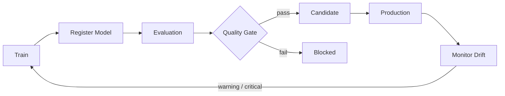

# ⚙️ MLOps Control Plane

**A MAK'MA Studio Product · MAK'MA Labs**

[Live Product Demo](https://maharshimak.github.io/makma-ai-os/projects/mlops-control-plane/) · [MAK'MA Labs](https://maharshimak.github.io/makma-ai-os/projects/)

A compact model lifecycle control plane for **registration, quality gates, promotion and drift monitoring**.


## Product contract — engineering upgrade

**Problem and audience:** A lifecycle policy workbench for ML engineers deciding whether model evidence supports rollout.

**Live tool:** https://maharshimak.github.io/makma-ai-os/projects/mlops-control-plane/

**Implemented browser workflow:** Candidate artifact metadata, multiple directional metric thresholds, baseline deltas, promotion gate, normalized PSI, production/candidate snapshots, canary and rollback decisions, traffic recommendation and fingerprinted governance JSON.

**Backend and parity contract:** Python CanarySnapshot now enforces integer requests, finite bounded probabilities and positive latency; rollout policies validate traffic and budgets. Browser mirrors core promotion/canary concepts and adds a combined orchestration gate: failed promotion or critical drift prevents advancement and rollback takes precedence.

**Architecture:** `makma-ai-os/demo` is the shared web product source and Pages deployment. This repository owns its Python domain package. The central `tests/e2e` suite exercises all nine products; `tests/fixtures/python-parity.json` plus `scripts/generate_parity.py` guard shared mathematical contracts. Backend revisions used for regeneration are pinned in the central `backend-lock.json`.

**Safety and limitations:** No infrastructure deployment or actual traffic changes. Model URI/fingerprint metadata and snapshots are user supplied. Manifest SHA-256 is reproducibility evidence, not a digital signature or verification of a remote artifact. Inputs are validated, rendered user values are escaped, and deterministic results are not presented as model inference.

**Verification:** Run `python -m ruff check .` and `python -m pytest -q`. `tests/test_engineering_upgrade.py` protects the new rejection/correctness paths. Central web checks: `npm ci`, `npm test`, `npm run build`, `npx playwright install --with-deps chromium`, `npm run test:e2e`. CI gates publishing on browser interactions and validates all public URLs after deployment.

**Lifecycle and deployment boundary:** model stages now follow an explicit one-way transition graph, and `HTTPDeploymentTarget` can carry bounded typed deploy/traffic/rollback commands to a configured infrastructure controller over HTTPS without embedding arbitrary shell execution in the policy engine.

**Highest-value next work:** Authenticated registry, signed artifacts and integration with a real rollout controller.

**Provenance:** Independent MAK’MA Studio engineering implementation; examples are synthetic and no employer code or data is included. Existing MIT license applies.


## Implemented

- model artifact registry
- SHA-256 dataset fingerprints
- evaluation records
- promotion policy
- stage transitions
- Population Stability Index (PSI)
- drift severity classification
- durable SQLite-backed model registry for API lifecycle state, plus standalone JSONL utilities
- immutable persisted lifecycle transition history for registration, candidate promotion, production promotion and archival
- FastAPI service
- tests
- Docker

## Lifecycle



## Why this project matters

The interesting part of production ML is not just training a model. Teams need to answer:

- Which dataset produced this artifact?
- Which metrics were used to approve it?
- Why was a model promoted?
- Which model is currently in production?
- What happens to the previous production version?
- Is the live data distribution drifting?

This project makes that lifecycle explicit and inspectable.

## Example

```python
from mlops_cp.models import Evaluation, ModelVersion
from mlops_cp.registry import ModelRegistry

registry = ModelRegistry()

registry.register(
    ModelVersion(
        name="churn",
        version="1.2.0",
        artifact_uri="s3://models/churn/1.2.0",
        dataset_fingerprint="sha256:...",
    )
)

registry.add_evaluation(
    "churn",
    "1.2.0",
    Evaluation(
        metric="roc_auc",
        value=0.91,
        threshold=0.85,
    ),
)

decision = registry.promote_candidate("churn", "1.2.0")

if decision.allowed:
    registry.promote_production("churn", "1.2.0")
```

## Roadmap

- MLflow adapter
- real artifact store
- approval workflow
- canary deployment policy
- shadow evaluation
- rollback history
- OpenTelemetry traces
- Prometheus metrics
- cloud deployment templates

## Scope and limitations

The API registry is SQLite-backed by default and persists model versions, evaluations, current stages and immutable lifecycle transition events across restart. JSONL state, lineage and canary helpers remain separate utilities rather than deployment integrations. Artifact URIs are metadata; artifacts are not uploaded or cryptographically verified. Registered models enter through gates, but library callers receive mutable model objects and are trusted. Thresholds are supplied by callers rather than an independent governance authority. No authentication, external rollout controller or automated infrastructure rollback is implemented.

## Installation and development

Requires Python 3.12 or newer. Run from this project directory.

```bash
python -m venv .venv
source .venv/bin/activate
python -m pip install -e ".[dev]"
python -m ruff check .
python -m pytest -q
python -m pip wheel --no-deps . -w dist
```

On Windows, activate with `.venv\Scripts\Activate.ps1`.

## Library usage

```python
from mlops_cp.models import ModelVersion, Evaluation
from mlops_cp.registry import ModelRegistry
r = ModelRegistry()
r.register(ModelVersion("demo", "1", "local/model.json", "synthetic-fingerprint"))
r.add_evaluation("demo", "1", Evaluation("accuracy", 0.9, 0.8))
print(r.promote_candidate("demo", "1"))
r.promote_production("demo", "1")
print(r.get("demo", "1").stage)
```

## Configuration

Library use needs no credentials. The API stores state at `MLOPS_CP_DB_PATH` (default `./data/control-plane.db`) and accepts `MLOPS_CP_API_TOKEN` for authenticated remote access.

## Service and API schema

```bash
python -m uvicorn mlops_cp.api:app --host 127.0.0.1 --port 8000
```

Interactive endpoint schemas are at `http://127.0.0.1:8000/docs`; machine-readable schemas are at `/openapi.json`. The API is local-only by default. Set `MLOPS_CP_API_TOKEN` to enable bearer-authenticated remote access; registry reads and all lifecycle mutations then require `Authorization: Bearer <token>`.

## Container

```bash
docker build -t mlops-control-plane .
docker run --rm -p 127.0.0.1:8000:8000 mlops-control-plane
```

## Repository structure

| Path | Purpose |
| --- | --- |
| `src/mlops_cp/` | Implementation |
| `tests/` | Offline unit and regression tests |
| `docs/DESIGN.md` | Architecture and trust boundaries |
| `.github/workflows/ci.yml` | Install, lint, tests, wheel and container build |
| `pyproject.toml` | Dependencies and package configuration |

## Next engineering work

Transactional multi-writer persistence; independent policy configuration; artifact checksums/signatures; authenticated approvals; real deployment adapters. These are planned work, not current capabilities.

## Contributing and security

See [CONTRIBUTING.md](CONTRIBUTING.md) and [SECURITY.md](SECURITY.md). CI runs on every push and pull request through `.github/workflows/ci.yml`.

## License and provenance

[MIT](LICENSE), copyright 2026 Maharshi Patel. This public portfolio implementation is independent of employer systems and contains no confidential employer code or data. Examples and test fixtures are synthetic.
